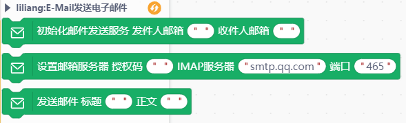
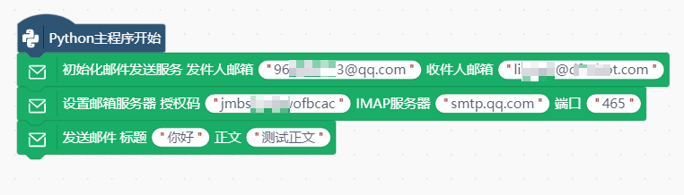

# 邮件发送


---------------------------------------------------------

## Table of Contents

* [URL](#url)
* [Summary](#summary)
* [Blocks](#blocks)
* [License](#license)
* [Supported targets](#Supportedtargets)

## URL
* Project URL : ```https://gitee.com/liliang9693/ext-baidufanyi```

* Tutorial URL : ```https://mindplus.dfrobot.com.cn/extensions-user```

* wiki URL : ```http://wiki.unihiker.com```


## Summary
适合Mind+Python模式的邮件发送库，推荐使用QQ邮件
在邮箱的**设置>账户**中开启**IMAP/SMTP服务**，然后**生成授权码**填到积木中。

参考教程：https://mc.dfrobot.com.cn/thread-313396-1-1.html

## Blocks




## Examples

> 注意：电脑需要联网，如果在行空板上使用，需要先让行空板联网。  



## License

MIT

## Supported targets

MCU                | JavaScript    | Arduino   | MicroPython    | unihiker
------------------ | :----------: | :----------: | :---------: | -----
arduino        |             |              |             | 
micro:bit        |             |              |             | 
esp32        |             |              |             | 
python        |             |              |             |  √

## Release Logs
* V0.0.1  基础功能完成


